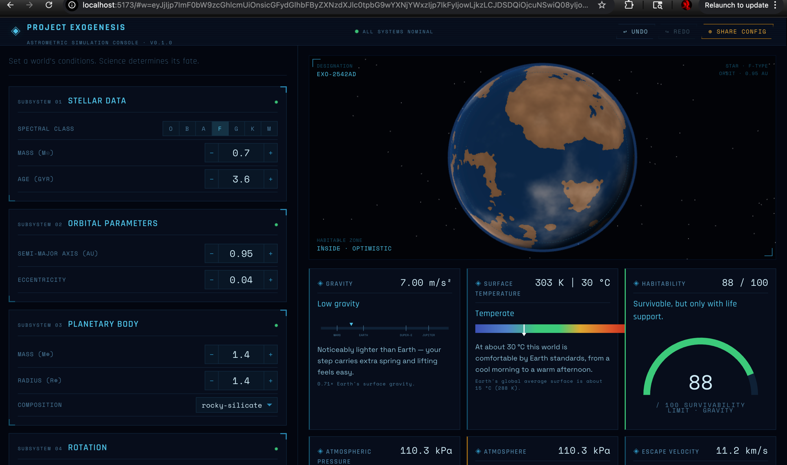
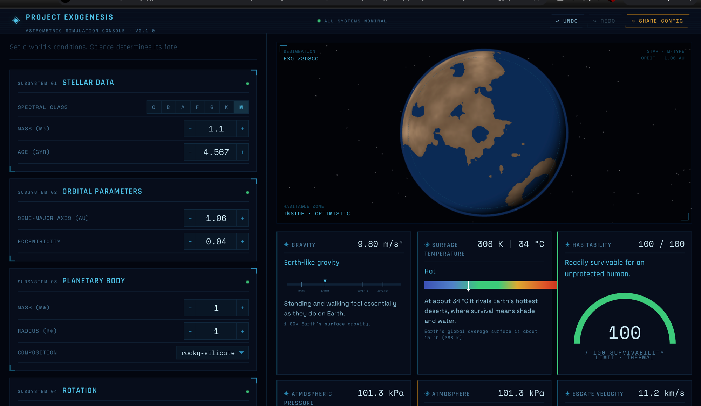
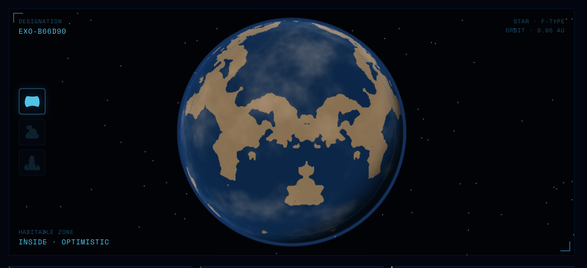
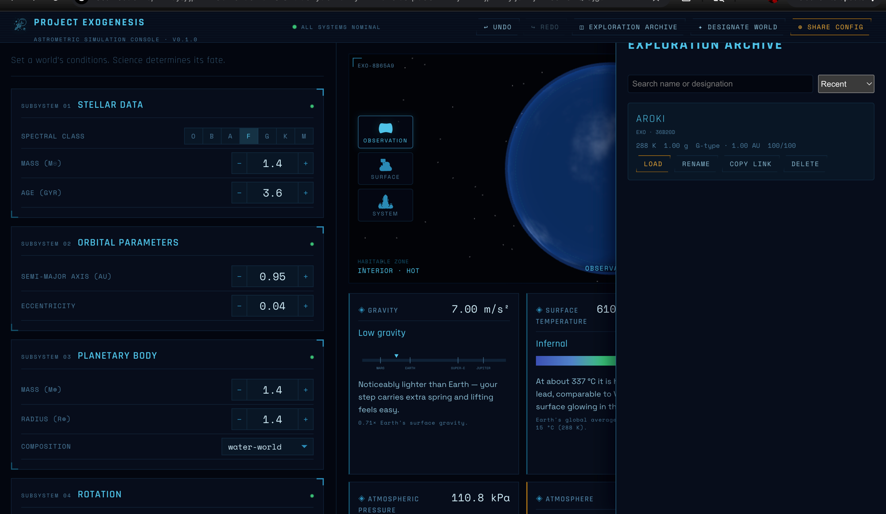
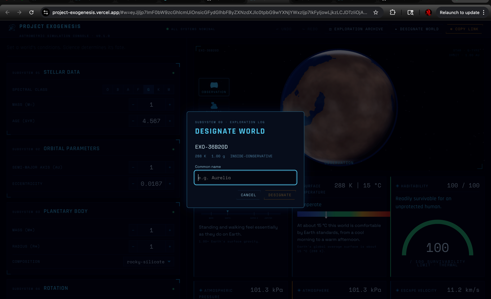

<div align="center">

# 🪐 Project Exogenesis

### Build a world from physics. Watch science decide its fate.

*An interactive exoplanet laboratory where every ocean, ice cap, and drifting cloud is **computed**, never painted.*

[](https://project-exogenesis.shannensaikia.in)
&nbsp;




</div>

---

## What is this?

You set a star, an orbit, a planet, and an atmosphere. A deterministic physics engine computes the rest — surface temperature, gravity, escape velocity, the habitable-zone position, whether liquid water can exist — and a custom GLSL shader renders the resulting world so it actually *looks* like what the numbers say.

It is **not a game**, **not a planet randomizer**, and **not stats cosplaying as science**. The guiding bar, from the project charter:

> *"This is not exactly how I would model it, but every decision here is physically defensible."*

Change a slider → the science responds → the planet visibly transforms. That's the whole magic trick, and there's no sleight of hand: the renderer and the AI are strictly **read-only consumers** of the physics. If a value can't be derived from physical law, it doesn't exist in the simulation.

---

## ✨ Highlights

| | |
|---|---|
| 🌍 **Physics-derived planet shader** | Oceans, continents, polar ice, molten glow, drifting clouds, and a fresnel atmospheric limb — every visual is a function of computed state (temperature, composition, water, pressure, stellar spectrum). No artistic overrides. |
| 🎥 **Multi-view camera** | One world, three honest framings: **Observation** (orbital), **Surface** (a close pass over the real fBm terrain), and **System** (pulled back to a clearly-labeled *schematic* orbit). |
| 🗺️ **Seeded procedural geography** | Continents are placed by deterministic fBm noise seeded from the world's hash — so the *same* world always grows the *same* coastlines, and a shared link reproduces them exactly. |
| 📖 **Exploration Archive** | Name worlds, save them to a local catalog, browse / load / rename / delete — your personal log of discovered planets (cosmetic only; never touches the physics). |
| 🤖 **AI narration & naming** | An optional layer that *describes* and *names* worlds in plain language — strictly read-only, tied to computed properties, and routed through a key-safe serverless proxy in production. |
| 🔗 **Backend-free sharing** | The entire world lives in the URL fragment. Copy the link, send it, and the recipient recomputes the identical planet — no server, no database. |

---

## 📸 Gallery

<div align="center">

**A temperate, Earth-like world — 100/100 survivability**


**An ocean world up close**


**The multi-view rail — Observation / Surface / System**


**Cataloging a discovery — the Designate modal**


</div>

> 💡 *Want motion?* The planet rotates, clouds drift, and the camera eases between views live — drop a short screen recording into `docs/media/` (e.g. `tour.gif`) and link it here to show it off.

---

## 🧠 How it works — the hierarchy is the whole architecture

```
        ┌──────────────────────────────────────────────┐
        │   You: star · orbit · planet · atmosphere      │
        └───────────────────────┬──────────────────────┘
                                 │ inputs only
                                 ▼
        ╔══════════════════════════════════════════════╗
        ║          PHYSICS ENGINE  (source of truth)     ║   deterministic,
        ║  temperature · gravity · escape velocity ·     ║   cited, unit-tested
        ║  habitable zone · liquid water · atmosphere     ║   to 100%
        ╚═══════════════════════╦══════════════════════╝
                                 │ computed PlanetaryState (read-only)
              ┌──────────────────┼───────────────────┐
              ▼                  ▼                   ▼
    ┌──────────────┐   ┌──────────────┐   ┌──────────────────┐
    │   RENDERER    │   │ TRANSLATION   │   │   AI EXPLAINER    │
    │ GLSL planet,  │   │ "1.8g" → "feels│   │ describes & names │
    │ derives every │   │  twice as hard"│   │ (never computes)  │
    │ pixel         │   │                │   │                   │
    └──────────────┘   └──────────────┘   └──────────────────┘
```

**No layer may influence the layer above it.** The renderer can't write physics; the AI can't invent a number. This separation is enforced by ESLint import boundaries and a stack of [ADRs](docs/adr/).

A few principles we held the line on:
- **Determinism** — identical inputs always produce identical worlds (no `Math.random()` in physics; everything seeds from an explicit hash).
- **Cited constants** — every physical constant carries a NIST/IAU/paper source comment; no magic numbers.
- **Honest visuals** — the one non-literal element (the System view's orbit) is explicitly labeled *"schematic · not to scale"*, because 1 AU is ~23,000 planet radii and can't be drawn truthfully beside the planet.

---

## 🔗 The shareable-world URL

Every world is encoded — **inputs only, never results** — into the URL fragment as a versioned, base64url JSON token:

```
https://project-exogenesis.shannensaikia.in/#w=<token>&n=<optional name>
```

Decode it and you get exactly what you set:

```jsonc
{
  "v": "0.1.0",
  "c": {
    "stellar":    { "spectralClass": "G", "massSolarMasses": 1, "ageGigayears": 4.567 },
    "orbital":    { "semiMajorAxisAstronomicalUnits": 1, "eccentricity": 0.0167 },
    "planetary":  { "compositionClass": "rocky-silicate", "massEarthMasses": 1, "radiusEarthRadii": 1 },
    "rotation":   { "rotationPeriodHours": 23.9345, "axialTiltDegrees": 23.44 },
    "atmosphere": { "partialPressuresKilopascals": { "N2": 78.08, "O2": 20.95, "CO2": 0.04, "H2O": 1.3, "Ar": 0.93 } }
  }
}
```

Because the physics is deterministic, the recipient recomputes the *same* world from those inputs — no backend required. (That example is Earth. 🌎)

---

## 🚀 Getting started

```bash
# 1. Install
npm install

# 2. (optional) enable the AI layer locally — get a free key at
#    https://aistudio.google.com/apikey
cp .env.example .env.local
#    then set VITE_GOOGLE_AI_API_KEY=... in .env.local

# 3. Run
npm run dev          # → http://localhost:5173
```

Without a key, the AI narration/naming features simply hide themselves — everything else works.

| Command | What it does |
|---|---|
| `npm run dev` | Start the dev server |
| `npm run build` | Type-check (app + serverless) and build for production |
| `npm run test` | Run the full Vitest suite |
| `npm run test:coverage` | Run tests with coverage gates (physics/translation 100%) |
| `npm run lint` | ESLint, including the architectural import boundaries |
| `npm run typecheck` | Strict TypeScript, zero `any` |

---

## 🛠️ Tech stack

- **TypeScript** (strict, `exactOptionalPropertyTypes`, zero implicit `any`)
- **Three.js** + hand-written **GLSL** for the physics-driven planet
- **React 19** + a tiny hand-rolled pub/sub store (no state-library dependency)
- **Vite 8** build; **Vitest** + Testing Library (492 tests)
- **Vercel** hosting + a serverless function proxying **Google Gemini** so the API key stays server-side

---

## ☁️ Deployment

Deployed on Vercel as a static SPA plus one serverless function (`api/generate.ts`) that holds the Gemini key server-side — it is **never** bundled into the client. Full instructions, including the env-var split and the "verify the key isn't exposed" check, live in **[DEPLOYMENT.md](DEPLOYMENT.md)**.

---

## 📐 Project structure

```
src/
├── physics/        # the source of truth — stellar, orbital, planetary,
│                   #   atmosphere, climate, habitability (100% tested, cited)
├── renderer/       # read-only consumer of physics → GLSL planet + scene
├── translation/    # numbers → felt human experience ("1.8g" → "walking is hard")
├── ai/             # read-only explainer + namer, provider-agnostic
├── store/          # pub/sub state, history, and the Exploration Archive
├── ui/             # React components — pure display, zero physics inline
└── types/          # shared contracts
api/                # the serverless AI proxy (Node)
docs/adr/           # architecture decision records — the "why"
```

---

## 🧭 Roadmap

- ✅ Physics engine, translation, renderer, AI narration (MVP)
- ✅ Breathtaking GLSL planet shader + multi-view camera
- ✅ Exploration Archive + shareable named worlds
- ✅ AI name suggestions
- ✅ Public deployment behind a key-safe proxy
- 🔭 **Next:** climate iteration, evolution simulation, multi-body systems, a public "Deep Field" catalog

---

<div align="center">

*Built to a single standard: **physically defensible**. Every decision in this repo can be argued in front of a planetary scientist.*

**[▶ Explore a world →](https://project-exogenesis.shannensaikia.in)**

</div>
